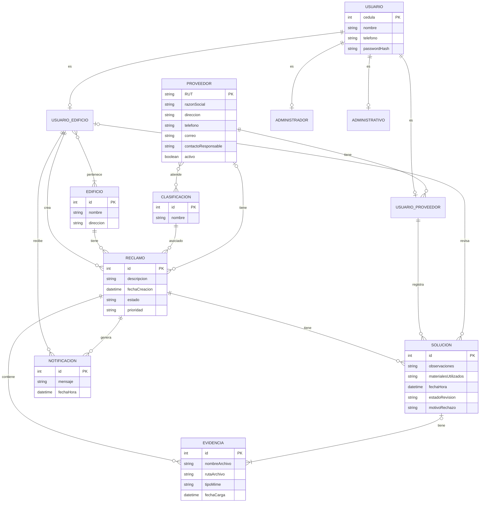

## Justificación de las decisiones del modelo relacional

| Decisión de diseño | Justificación | Origen |
|---|---|---|
| `Usuario.passwordHash` en lugar de almacenar la contraseña en texto plano | Las contraseñas se requieren para autenticación y restablecimiento de acceso, pero por protección de datos sensibles no deben almacenarse directamente. Se conserva únicamente su hash. | RF-01, RF-03, RF-21, HU1, HU2, HU26, RNF-03, RNF-10 |
| `Usuario.cedula` como clave primaria | La cédula identifica a la persona registrada y está presente tanto para Usuarios de edificio como para Usuarios de proveedor. Utilizarla como PK evita agregar un identificador artificial adicional para `Usuario`. | RF-01, RF-23, HU1, HU27 |
| Herencia de `Usuario` implementada conservando una entidad común para los datos compartidos | Los cuatro roles comparten cédula, nombre, teléfono y credenciales. Mantener estos datos en `Usuario` evita duplicarlos en cada subtipo y permite que los subtipos almacenen únicamente la información específica de su rol. | RF-15, RF-16, HU2, HU3 |
| `Proveedor.RUT` como clave primaria | El RUT es el identificador fiscal requerido para cada proveedor y permite distinguir de forma única a las empresas registradas sin introducir un identificador adicional. | RF-18 |
| Relación N:M entre `UsuarioEdificio` y `Edificio` | Un Usuario de edificio puede pertenecer a uno o más edificios y un edificio puede tener varios usuarios asociados. La relación se modela como muchos-a-muchos para representar correctamente esa pertenencia. | RF-20, HU25 |`Proveedor`–`Clasificacion` | Un proveedor puede atender varias clasificaciones y una clasificación puede corresponder a varios proveedores. La tabla intermedia permite registrar estas combinaciones sin duplicar datos en ninguna de las dos entidades. | HU14 |
| FK de `Clasificacion` ubicada en `Reclamo` | Cada reclamo tiene exactamente una clasificación, mientras que una clasificación puede utilizarse en muchos reclamos. Al tratarse de una relación 1:N, la clave foránea se almacena del lado N, es decir, en `Reclamo`. | RF-04, RF-05, HU4, HU5 |
| FK de `Edificio` ubicada en `Reclamo` | Cada reclamo pertenece a un único edificio y un edificio puede acumular muchos reclamos. La FK se coloca en `Reclamo`, que constituye el lado N de la relación. | RF-25, HU25 |
| FK de `Proveedor` en `Reclamo` permitiendo `NULL` | Un reclamo puede crearse antes de que el Administrativo seleccione un proveedor. Por eso la referencia al proveedor debe poder permanecer vacía hasta que se realice la asignación. | RF-07, HU13 |
| `Clasificacion` como tabla y no como `ENUM` | Las clasificaciones son administrables: el Administrador puede crear y editar sus valores. Utilizar una tabla permite modificar el catálogo sin alterar la estructura de la base de datos. | RF-05, HU5, HU23 |
| `estadoRevision` de `Solucion` como conjunto cerrado de valores | El proceso de revisión solo contempla estados definidos por el flujo: pendiente, aprobada o rechazada. Un conjunto cerrado evita almacenar valores no previstos. | HU20 |
| `motivoRechazo` permite `NULL` | El motivo solo existe cuando una solución es rechazada. Una solución pendiente o aprobada no necesita almacenar este dato, por lo que el campo debe ser opcional. | HU17, HU20 |
| Varias filas de `Solucion` pueden referenciar el mismo `Reclamo` | Cuando una solución es rechazada, el proveedor puede registrar un nuevo intento. Se conserva cada solución como una fila independiente para no sobrescribir los intentos anteriores y mantener la trazabilidad. | RF-14, RF-24, HU16, HU17, HU20 |
| `Evidencia` almacena metadatos y no el archivo directamente en MySQL | La arquitectura establece almacenamiento de archivos en filesystem. Por eso la base conserva datos como nombre, ruta, tipo MIME y fecha de carga, mientras que el contenido del archivo permanece fuera de la tabla. | RNF-05, HU18 |
| FK de `Solucion` en `Evidencia` permitiendo `NULL` | Toda evidencia pertenece a un reclamo, pero las evidencias iniciales no corresponden a ninguna solución. Solo las evidencias de resolución necesitan una referencia a `Solucion`, por lo que esa FK debe ser opcional. | RF-04, RF-12, HU4, HU16, HU18, HU19 |
| `Notificacion` se almacena como registro persistente y referencia a `UsuarioEdificio` y `Reclamo` | Cada aviso debe identificar tanto al destinatario como al reclamo que produjo la actualización. Esto permite mantener el historial de notificaciones del usuario y conocer su origen. | RF-09, HU8 |
| Uso de `DATETIME` para `fechaCreacion`, `fechaHora` y `fechaCarga` | Estas operaciones requieren conocer no solo el día sino también el momento en que ocurrieron, permitiendo ordenar cronológicamente reclamos, soluciones, evidencias y notificaciones. | RF-09, RF-24, HU8, HU16, HU18 |
| `Proveedor.activo` en lugar de eliminar físicamente proveedores | El sistema debe permitir desactivar proveedores para impedir nuevas asignaciones. Mantener el registro evita perder referencias históricas desde reclamos que ya fueron atendidos por ese proveedor. | RF-17, HU22 |