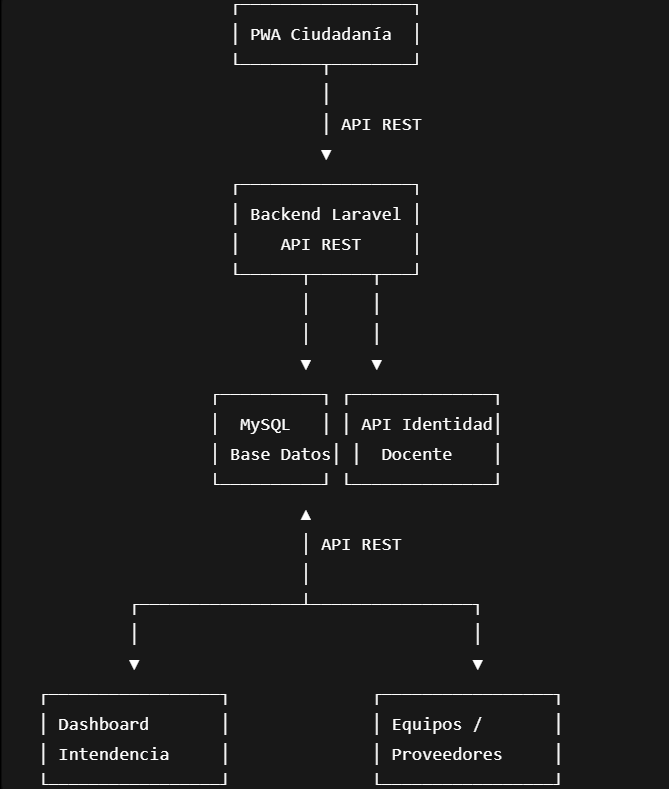
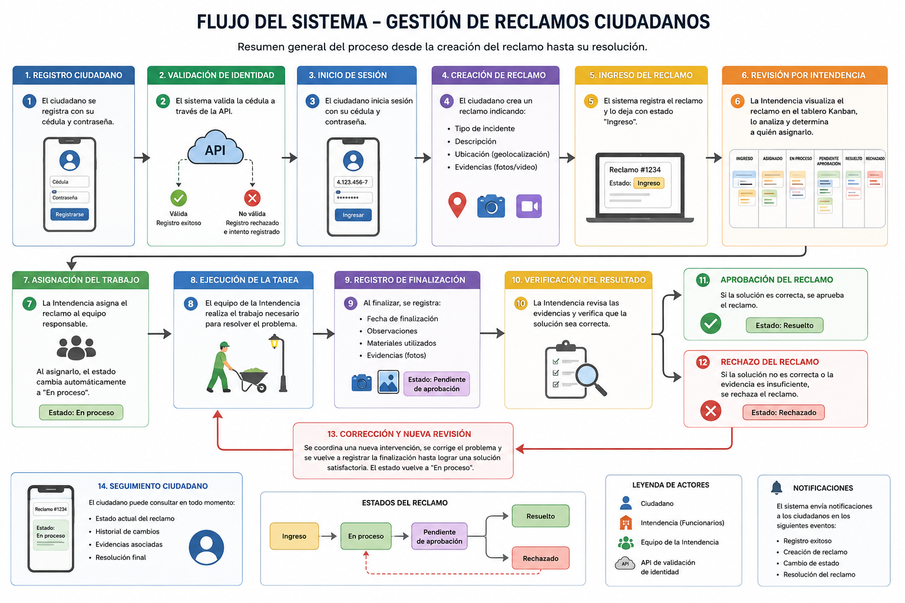

# Diseño del Sistema

## Arquitectura

El sistema seguirá una arquitectura cliente-servidor compuesta por tres interfaces frontend y un backend centralizado.

### Frontend

**PWA Ciudadanía**

- Registro e inicio de sesión.
- Creación de reclamos.
- Consulta de estados.
- Recepción de notificaciones.

**Dashboard Intendencia**

- Gestión de reclamos mediante tablero Kanban.
- Asignación de tareas.
- Aprobación o rechazo de trabajos.
- Consulta de estadísticas.

**Frontend Equipos/Proveedores**

- Consulta de tareas asignadas.
- Registro de inicio y finalización de trabajos.
- Carga de evidencias.
- Registro de materiales utilizados.

### Backend

El backend centraliza toda la lógica de negocio:

- Autenticación y autorización mediante Laravel Sanctum o JWT.
- Gestión de usuarios y roles.
- Gestión de reclamos y estados.
- Integración con la API de validación de identidad.
- Gestión de evidencias multimedia.
- Generación de estadísticas.
- Registro del historial de actividades.

### Comunicación

Los tres frontends se comunicarán con el backend mediante una API REST. El backend será el único encargado de acceder a la base de datos y a la API externa de validación de identidad.

## API REST preliminar

### Autenticación

| Método | Endpoint | Descripción |
| --- | --- | --- |
| POST | /auth/register | Registrar un nuevo ciudadano. |
| POST | /auth/login | Iniciar sesión. |
| POST | /auth/verify-ci | Validar identidad mediante la API docente. |

### Gestión de Reclamos

| Método | Endpoint | Descripción |
| --- | --- | --- |
| POST | /reclamos | Crear un reclamo. |
| GET | /reclamos/my | Obtener los reclamos del usuario autenticado. |
| GET | /reclamos | Listar todos los reclamos. |
| GET | /reclamos/{id} | Obtener un reclamo específico. |
| PATCH | /reclamos/{id}/assign | Asignar a un equipo. |
| PATCH | /reclamos/{id}/start | Iniciar resolución. |
| PATCH | /reclamos/{id}/finish | Finalizar trabajo. |
| PATCH | /reclamos/{id}/approve | Aprobar resolución. |
| PATCH | /reclamos/{id}/reject | Rechazar resolución. |

### Gestión de Evidencias

| Método | Endpoint | Descripción |
| --- | --- | --- |
| POST | /reclamos/{id}/media | Subir fotografías, videos o documentos. |
| GET | /media/{id} | Obtener una evidencia. |

## Base de Datos

### Tabla: usuarios

| Campo | Tipo |
| --- | --- |
| id | BIGINT |
| nombre | VARCHAR |
| apellido | VARCHAR |
| documento | VARCHAR |
| email | VARCHAR |
| password | VARCHAR |
| rol | ENUM |
| validado | BOOLEAN |

### Tabla: reclamos

| Campo | Tipo |
| --- | --- |
| id | BIGINT |
| usuario_id | BIGINT |
| tipo | VARCHAR |
| descripcion | TEXT |
| latitud | DECIMAL |
| longitud | DECIMAL |
| estado | ENUM |
| fecha_creacion | DATETIME |

### Tabla: historial_actividad

| Campo | Tipo |
| --- | --- |
| id | BIGINT |
| reclamo_id | BIGINT |
| usuario_id | BIGINT |
| estado_anterior | VARCHAR |
| estado_nuevo | VARCHAR |
| observaciones | TEXT |
| fecha | DATETIME |

### Tabla: multimedia

| Campo | Tipo |
| --- | --- |
| id | BIGINT |
| reclamo_id | BIGINT |
| ruta_archivo | VARCHAR |
| tipo_archivo | VARCHAR |
| fecha_subida | DATETIME |

### Tabla: proveedores

| Campo | Tipo |
| --- | --- |
| id | BIGINT |
| nombre | VARCHAR |
| contacto | VARCHAR |
| tipo | VARCHAR |

### Tabla: materiales (opcional)

| Campo | Tipo |
| --- | --- |
| id | BIGINT |
| nombre | VARCHAR |
| descripcion | TEXT |

## Tecnologías

### Backend

- PHP 8
- Laravel
- API REST

### Base de Datos

- MySQL

### Frontend

- HTML5
- CSS3
- JavaScript
- Bootstrap o Tailwind CSS

### Control de Versiones

- Git
- GitHub

### Herramientas de Desarrollo

- Visual Studio Code
- XAMPP
- Postman

### Servicios Externos

- API docente de validación de identidad

## Diagrama de Arquitectura

## Diagrama de Flujo

## Flujo del Sistema

1. Registro del ciudadano.
2. Validación de identidad.
3. Inicio de sesión.
4. Creación del reclamo.
5. Registro del reclamo con estado **Ingreso**.
6. Revisión por la Intendencia.
7. Asignación al equipo responsable.
8. Ejecución de la tarea.
9. Registro de finalización con evidencias.
10. Verificación del resultado.
11. Aprobación o rechazo.
12. Si se rechaza, se realiza una nueva intervención.
13. El ciudadano puede consultar en todo momento el estado, historial y evidencias del reclamo.