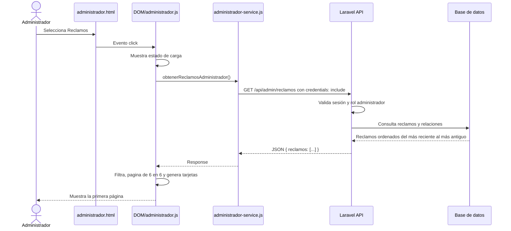

# Flujo de programación: reclamos y paginación del administrador

**Fecha de actualización:** 3 de octubre de 2026  
**Módulo:** Panel del administrador  
**Alcance:** Reclamos, Proveedores y Edificios

## 1. Objetivo del cambio

El panel del administrador ahora incorpora una categoría llamada **Reclamos**. Desde ella, un usuario con rol `administrador` puede consultar todos los reclamos registrados mediante el endpoint:

```http
GET http://localhost:8000/api/admin/reclamos
```

Además, las vistas de **Reclamos**, **Proveedores** y **Edificios** muestran un máximo de **6 registros por página**.

## 2. Archivos involucrados

| Archivo | Responsabilidad |
|---|---|
| `src/frontend/html/administrador.html` | Agrega el botón Reclamos al menú lateral y carga la versión actualizada del JavaScript. |
| `src/frontend/js/services/administrador-service.js` | Expone la función que consulta `/api/admin/reclamos` con la sesión del navegador. |
| `src/frontend/js/DOM/administrador.js` | Carga y presenta los reclamos, aplica filtros y controla la paginación de las tres categorías. |
| `src/frontend/css/style-administrador.css` | Define las tarjetas, estados, controles, mensajes y paginación del administrador. |
| `src/backend/routes/api.php` | Registra la ruta protegida `GET /api/admin/reclamos`. |
| `src/backend/app/Http/Controllers/ReclamoController.php` | Comprueba el rol del usuario y construye la respuesta HTTP. |
| `src/backend/app/services/ReclamoService.php` | Obtiene todos los reclamos con sus relaciones. |
| `src/backend/app/Models/Reclamo.php` | Define las relaciones con usuario, edificio, clasificación y evidencia. |

## 3. Flujo completo de consulta de reclamos



### 3.1 Protección del endpoint

La ruta está dentro de los middleware `web` y `auth:sanctum`. El controlador realiza una segunda comprobación del rol:

- Sin sesión válida: respuesta `401`.
- Usuario autenticado sin rol `administrador`: respuesta `403` con `No autorizado`.
- Administrador válido: respuesta `200` con la colección de reclamos.

### 3.2 Datos incluidos

El servicio del backend usa carga anticipada de las siguientes relaciones:

- `usuario`: persona que creó el reclamo.
- `edificio`: edificio asociado.
- `clasificacion`: tipo o clasificación del reclamo.
- `evidencia`: archivo de evidencia asociado.

La respuesta tiene esta estructura general:

```json
{
  "reclamos": [
    {
      "id": 1,
      "usuario_cedula": "...",
      "edificio_id": 1,
      "clasificacion_id": 1,
      "description": "Descripción del problema",
      "estado": "pendiente",
      "created_at": "2026-10-03T12:00:00.000000Z",
      "usuario": {},
      "edificio": {},
      "clasificacion": {},
      "evidencia": {}
    }
  ]
}
```

## 4. Flujo del frontend de Reclamos

### 4.1 Entrada desde el menú

`administrador.html` contiene el botón `.reclamos-btn`. Al seleccionarlo:

1. Se marca el botón como activo.
2. `paginaReclamos` vuelve a `1`.
3. Se ejecuta `vistaReclamos()`.
4. Se muestra el mensaje `Cargando reclamos...`.
5. Se llama a `obtenerReclamosAdministrador()`.

### 4.2 Acceso HTTP

`obtenerReclamosAdministrador()` reutiliza el helper `obtenerListado()` y realiza:

```js
apiFetch("/api/admin/reclamos", {
    method: "GET",
    credentials: "include",
    headers: {
        "Accept": "application/json"
    }
});
```

Cuando la aplicación se ejecuta en `http://localhost:5501`, la configuración existente usa el proxy del contenedor frontend. En otros puertos de desarrollo, `api.js` utiliza la URL configurada para el backend.

### 4.3 Presentación de cada reclamo

Cada tarjeta muestra:

- número del reclamo;
- estado;
- imagen de evidencia, si existe;
- descripción;
- nombre del usuario o su cédula como alternativa;
- edificio;
- clasificación;
- fecha y hora formateadas para `es-UY`.

Los valores insertados en el HTML pasan por `escaparHtml()` para reducir el riesgo de inyección de contenido. Si una imagen no existe o no puede cargarse, se reemplaza por el icono `image_not_supported`.

### 4.4 Estados reconocidos

La interfaz contempla nombres principales y alias:

| Estado recibido | Texto mostrado |
|---|---|
| `pendiente` o `enviado` | Pendiente |
| `validado` o `aceptado` | Validado |
| `en_proceso` o `proceso` | En proceso |
| `completado` o `terminado` | Completado |
| `rechazado` | Rechazado |

## 5. Búsqueda y filtro de reclamos

La vista permite buscar por:

- ID del reclamo;
- descripción;
- nombre o cédula del usuario;
- nombre o dirección del edificio;
- clasificación;
- estado.

La búsqueda ignora mayúsculas, minúsculas y tildes. También existe un selector para filtrar por estado.

El orden de procesamiento es:

```text
Reclamos recibidos
        ↓
Filtro de texto
        ↓
Filtro de estado
        ↓
Paginación de los resultados filtrados
        ↓
Renderizado de hasta 6 tarjetas
```

Cada modificación de búsqueda o estado reinicia `paginaReclamos` en `1`. De esta manera no se conserva una página que pueda dejar de existir después del filtro.

## 6. Paginación compartida

La constante que controla el límite se encuentra en `DOM/administrador.js`:

```js
const LIMITE_PAGINACION_ADMIN = 6;
```

Los estados de página son independientes:

```js
let paginaReclamos = 1;
let paginaProveedores = 1;
let paginaEdificios = 1;
```

La función `paginarElementos()`:

1. Calcula el total de páginas con `Math.ceil(total / 6)`.
2. Impide que la página sea menor que `1` o mayor que la última disponible.
3. Calcula el índice inicial con `(paginaActual - 1) * 6`.
4. Obtiene únicamente los seis elementos correspondientes mediante `slice()`.

`renderPaginacionAdministrador()` genera el control compartido con:

- botón **Anterior**;
- texto `Página X de Y · N elementos`;
- botón **Siguiente**.

Los botones se deshabilitan cuando el usuario está en la primera o última página. Si existen seis elementos o menos, el control no se muestra.

## 7. Paginación por categoría

### 7.1 Reclamos

1. El endpoint entrega la colección completa.
2. `renderListaReclamos()` aplica búsqueda y estado.
3. Los resultados filtrados pasan por `paginarElementos()`.
4. Solo se generan las tarjetas de la página actual.
5. Cambiar de página conserva la búsqueda y el estado seleccionados.

### 7.2 Proveedores

1. Los proveedores se cargan durante `iniciarAplicacion()` mediante `/api/proveedores`.
2. `vistaProveedores()` aplica el filtro `Todos`, `Activos` o `Desactivados`.
3. La colección filtrada pasa por `paginarElementos()`.
4. Solo se muestran hasta seis proveedores.
5. Cambiar el filtro de estado reinicia `paginaProveedores` en `1`.
6. Al abrir el detalle y regresar, se conserva la página actual.

### 7.3 Edificios

1. Los edificios se cargan durante `iniciarAplicacion()` mediante `/api/edificios`.
2. `vistaEdificios()` pasa la colección a `paginarElementos()`.
3. Solo se muestran hasta seis edificios.
4. Al abrir el detalle y regresar, se conserva la página actual.

Al seleccionar nuevamente cualquiera de las tres categorías desde el menú lateral, su página vuelve a `1`.

## 8. Manejo de errores y casos especiales

### Reclamos

- Mientras se espera la API, se muestra un indicador de carga.
- Si la sesión expiró y la respuesta es `401`, se redirige a `index.html`.
- Si la API devuelve otro error, se presenta el mensaje y un botón **Reintentar**.
- Si no existen reclamos o ningún resultado coincide con los filtros, se presenta un estado vacío.
- Si el usuario cambia de categoría mientras la petición está pendiente, la respuesta tardía no reemplaza la vista activa.

### Paginación

- Una página fuera de rango se corrige automáticamente.
- Si una actualización reduce la cantidad de registros, la página actual se ajusta a la última válida.
- Los controles no aparecen cuando no son necesarios.

## 9. Estilos agregados

`style-administrador.css` incorpora estilos para:

- cuadrícula de reclamos;
- tarjetas y evidencias;
- insignias de estado;
- buscador y selector de estado;
- estados de carga, error y lista vacía;
- controles `.paginacion-admin` y `.btn-pagina-admin`;
- adaptación a pantallas pequeñas;
- compatibilidad con los temas claro y oscuro existentes.

## 10. Actualización de caché

El módulo del administrador se carga con el parámetro de versión:

```html
<script src="/proyecto-utu-2026/src/frontend/js/DOM/administrador.js?v=4" type="module"></script>
```

El cambio de versión evita que el navegador conserve una copia anterior del JavaScript después de desplegar la paginación.

## 11. Consideración técnica importante

La paginación actual es **del lado del cliente**. Los endpoints de Reclamos, Proveedores y Edificios entregan las colecciones completas, y el navegador selecciona grupos de seis elementos.

Este enfoque mantiene compatibilidad con los flujos actuales porque las listas completas de proveedores y edificios también se usan en formularios y asociaciones. Si la cantidad de registros crece considerablemente, conviene incorporar paginación en el backend mediante parámetros como `page` y `per_page`, sin cambiar las respuestas utilizadas por los demás módulos.

## 12. Cómo cambiar el límite

Para modificar la cantidad de elementos por página, solo se debe cambiar:

```js
const LIMITE_PAGINACION_ADMIN = 6;
```

No es necesario modificar por separado las vistas de Reclamos, Proveedores y Edificios.

## 13. Validaciones realizadas

Durante la implementación se verificó:

- sintaxis de los módulos JavaScript con Node.js;
- ausencia de errores de espacios mediante `git diff --check`;
- construcción correcta de la imagen Docker del frontend;
- publicación del JavaScript y CSS actualizados;
- registro de la ruta `GET /api/admin/reclamos` en Laravel;
- protección `401` del endpoint cuando no existe una sesión válida;
- estado saludable del contenedor frontend en `http://localhost:5501`.

## 14. Lista de comprobación manual

1. Iniciar sesión con un usuario administrador.
2. Entrar a **Reclamos** y comprobar que aparecen como máximo seis tarjetas.
3. Usar **Siguiente** y **Anterior**.
4. Buscar un reclamo y confirmar que la página vuelve a la primera.
5. Filtrar por estado y comprobar el contador.
6. Entrar a **Proveedores** y verificar el límite de seis.
7. Cambiar entre Todos, Activos y Desactivados.
8. Entrar a **Edificios** y verificar el límite de seis.
9. Probar las tres vistas en tema claro y oscuro.
10. Reducir el ancho del navegador y verificar la presentación adaptable.

