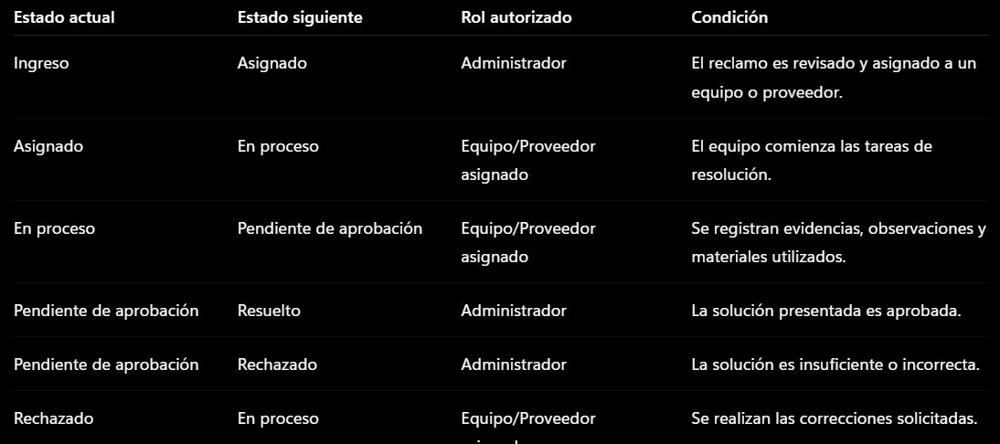
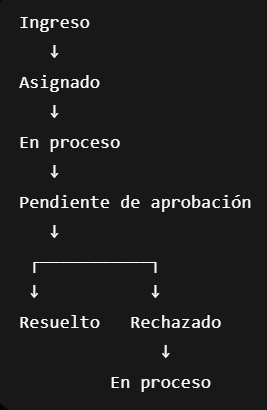

# Requisitos del sistema

## Requerimientos funcionales
• Crear reclamos.
• Subir evidencia multimedia (fotografías y videos).
• Geolocalización automática del incidente.
• Seguimiento del estado del reclamo.
• Historial de reclamos del ciudadano.
• Asignación de tareas.
• Gestión mediante tablero Kanban.
• Aprobación o rechazo de reclamos.
• Generación de reportes estadísticos.
• Auditoría e historial de actividad.

RF1: Autenticación y control de accesos mediante Cédula de Identidad para Ciudadanos y
Administradores.
RF2: Registro de ciudadanos con validación obligatoria de identidad utilizando una API externa.
RF3: Registro de intentos fraudulentos cuando la validación de identidad falle.
RF4: Creación de reclamos con tipo de incidente, descripción, geolocalización y evidencia
multimedia.
RF5: Seguimiento en tiempo real del estado de los reclamos.
RF6: Panel de control Kanban para administradores.
RF7: Gestión del ciclo de vida de los reclamos únicamente por administradores.
RF8: Carga obligatoria de notas técnicas, materiales utilizados y fotografías antes del cierre
técnico.
RF9: Aprobación o rechazo definitivo de reclamos con observaciones.
RF10: Generación automática de reportes estadísticos municipales.
RF11: Registro inmutable de cada cambio realizado en el sistema

## Reglas de negocio

### Definir reglas de transición entre estados

El sistema controlará qué usuarios pueden cambiar el estado de un reclamo y bajo qué condiciones, garantizando la trazabilidad y evitando modificaciones no autorizadas.

### Reglas de transición

### Restricciones

* Solo los administradores pueden asignar, aprobar o rechazar reclamos.
* Solo el equipo o proveedor asignado puede iniciar y finalizar tareas.
* Un reclamo en estado **Resuelto** no podrá volver a modificarse.
* Todas las transiciones deberán registrarse en el historial de actividad del sistema.
* No se permitirá avanzar a **Pendiente de aprobación** sin evidencias de finalización.

### Definir flujo de estados de los reclamos

El ciclo de vida de un reclamo seguirá la siguiente secuencia de estados:

**Ingreso → Asignado → En proceso → Pendiente de aprobación → Resuelto**

En caso de que la solución presentada no sea aceptada por la administración, el reclamo pasará al estado:

**Pendiente de aprobación → Rechazado → En proceso**

### Descripción de estados

* **Ingreso:** Reclamo creado por el ciudadano y pendiente de revisión.
* **Asignado:** Reclamo asignado a un equipo o proveedor responsable.
* **En proceso:** El equipo o proveedor se encuentra trabajando en la resolución.
* **Pendiente de aprobación:** El trabajo fue finalizado y espera validación de la administración.
* **Resuelto:** La solución fue aprobada y el reclamo se considera cerrado.
* **Rechazado:** La solución presentada no cumple los requisitos y debe corregirse.

### Diagrama de flujo

Ingreso
↓
Asignado
↓
En proceso
↓
Pendiente de aprobación
↓
Resuelto

Si es rechazado:

Pendiente de aprobación
↓
Rechazado
↓
En proceso

### Flujo de estados

## Requerimientos no funcionales

RNF1: La aplicación deberá desarrollarse como una Progressive Web App (PWA), permitiendo su uso eficiente desde teléfonos móviles, con una interfaz optimizada para pantallas pequeñas y acceso rápido desde el navegador sin necesidad de instalación tradicional.

RNF2: El dashboard administrativo deberá ser completamente responsive, adaptándose correctamente a diferentes resoluciones de pantalla en computadoras de escritorio y tablets, manteniendo una experiencia de uso cómoda e intuitiva.

RNF3: El sistema deberá ofrecer tiempos de respuesta inferiores a 3 segundos para las operaciones más frecuentes, como consultas, creación de reclamos y cambios de estado, bajo condiciones normales de uso.

RNF4: La información estructurada deberá almacenarse en una base de datos MySQL, mientras que las fotografías y videos asociados a los reclamos deberán guardarse en un sistema de archivos organizado y seguro.

RNF5: La autenticación y autorización de usuarios deberá implementarse utilizando mecanismos seguros como JWT o Laravel Sanctum, garantizando el acceso únicamente a usuarios autorizados. 

RNF6: El sistema deberá cumplir con buenas prácticas de protección de datos personales, asegurando la confidencialidad, integridad y disponibilidad de la información de los ciudadanos. 

RNF7: Se deberán realizar copias de seguridad automáticas de forma diaria para minimizar el riesgo de pérdida de información y facilitar la recuperación ante incidentes técnicos. 

RNF8: La arquitectura del sistema deberá permitir su crecimiento futuro, soportando un aumento en la cantidad de usuarios, reclamos y archivos multimedia sin requerir una reestructuración completa.
